---
typora-copy-images-to: docs
---

# **蓝色手柄使用手册**

## **1.功能说明**
蓝牙手柄支持通过蓝牙或者wifi的方式连接电脑客户端。连接成功后，支持将手机作为游戏机手柄、千千静听或者ppt的遥控器。只须在手机上点击某个按钮，就能实现电脑上软件的某个功能得到执行。

## **2.硬件要求**
移动端：支持蓝牙或者wifi的安卓手机或者平板.

电脑端：电脑适用的蓝牙适配器(如果使用蓝牙方式接入的话).
## **3.软件配置**
### **3.1 电脑端软件配置**
3.1.1和3.1.2所说的配置，只需满足一项，就可以使用本软件。
#### **3.1.1蓝牙接入设置**

当然，你得保证你的电脑上有蓝牙适配器，否则还是使用3.1.3 介绍的wifi接入方式，如果你有蓝牙适配器，那么其配置步骤如下：

A）如果要电脑接收蓝牙信号，需要开启蓝牙的COM端口，首先我们要做的是找到蓝牙的设备图标，在电脑任务栏的托盘区域找到图标，或者在控制面板中找到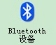图标。如果你在以上所说的任何一处找到蓝牙的图标，双击打开（如果你两种方法都试了，但是还是找不到蓝牙设备的图标，说明你没有正确安装蓝牙的驱动或者干脆说你的电脑根本就没有），然后选择COM端口选项卡。

如果打开后会显示当前开启端口的列表，如果你之前没有做过设置的话，那么它应该是空的。如图3.1.2-1所示。如果列表不为空，且至少有一行内容显示的“方向”列为“传入”，那么你现在已经不用再做任何设置了，否则你需要继续做B）步骤。

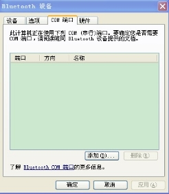

图3.1.2-1

B）点击图3.1.2-1的按钮，会打开图3.1.2-2所示界面，选择“传入（设备初始化连接）（N）”，然后点击确定。之后的界面如图3.1.2-3所示，COM端口选项卡中多了一条记录，且其“方向”列的内容为“传入”。

图3.1.2-2

61")

图3.1.2-3
#### **3.1.2 wifi接入设置**
Android设备要连接wifi的话，必须得有无线网络才行。如果你所在的环境中有可用的无线网络，那么恭喜你，你不用做任何设置。

如果你所在的环境中没有无线网络，那么也不是世界末日，如果你有笔记本的话，还是可以借助笔记本的无线网卡搭建一个无线网络的。这个在网上有很多教程。我做了一下摘录，如下：

- WIN7

WIN7环境下的教程《笔记本设置WIFI环境，让iPhone/ipod touch上网》 :

<http://louishan.com/articles/wifi-iphone-ipod.html>

win7 下也可以通过两个命令行来建立一个无线路由器：

netsh wlan set hostednetwork key=aaaaaaaa ssid=sunnywifi 

其中aaaaaaaa为连接密码，sunnywifi为路由器名字

netsh wlan start hostednetwork

运行上述命令来启动这个路由器。启动路由器后，就可以用手机来连接它了。

- XP

XP环境下的教程《XP系统笔记本给M8做Wifi热点详细教程》

<http://m8.chinameizu.com/view-400-1.html>
## **4 软件运行**

### **4.1 运行电脑端程序**
运行bluetoothehandle.exe，会打开如下界面

图4.1-1
### **4.2 运行安卓端应用**
在你的安卓手机的桌面上找到这个图标，然后点击运行，会显示如下界面：

图4.2-1
## **5. 软件操作**
以下是这份的文档的核心的部分，通过5.1可以获知蓝牙手柄软件可以操控按键方式；5.2和5.3是蓝牙手柄软件和电脑连接的两种方式，选择其中任何一种方式就可以和电脑做连接；接下来就是各个按键的具体操作，在5.4做详细介绍。

### **5.2 连接电脑**
首先点击图4.2-1中的“设置”按钮，点击设置界面，显示如下界面：

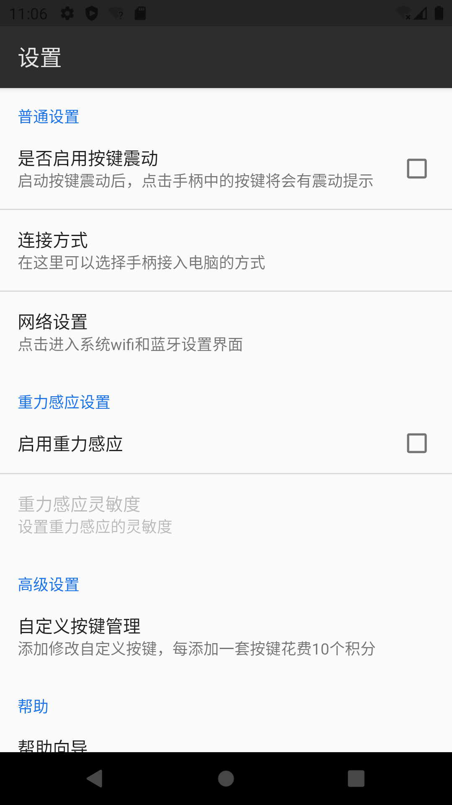

图5.2-1

点击“连接方式后”，会弹出选择提示，点击您想使用的方式，即可设置生效。

图5.2-2
#### **5.2.1 wifi方式**
1) 首先在图5.2-2中使用“wifi方式”。Wifi方式使用无线网络，需要首先将手机的ip记录下来，以备在电脑上连接的时候使用。具体做法如下, 在图4.2-1所示的界面中，点击“设置”，进入设置界面，点击“网络设置”。

图 5.2.1-1

在打开的界面中，选择“无线和网络”。

图5.2.1-2

勾选“WLAN”选项，然后点击“WLAN设置”，进入图5.2-3所示的画面，点击已经连接的无线网络名字，会显示一个对话框，如图5.2-4所示，记录下来当前手机的ip，即图中显示的“ip地址：”的内容，然后点击“取消”，退出设置界面。

图5.2.1-3

图5.2.1-4

图5.2.1-5 

B)然后运行手机端程序，点击软件中的绿色按钮，会出现如下提示。

图5.2.1-6

C)之后运行电脑端程序后，选择“wifi方式”，如下图所示，点击“开始”按钮显示图5.2-8界面，输入刚才在手机中记录的ip地址，然后点击“开始”按钮。

图5.2.1-7

图5.2.1-8

D）如果连接成功，电脑端程序会显示“初始化成功”提示信息（如图5.2-9所示），手机端会直接显示手柄界面（如图5.2-10所示）。

图5.2.1-9

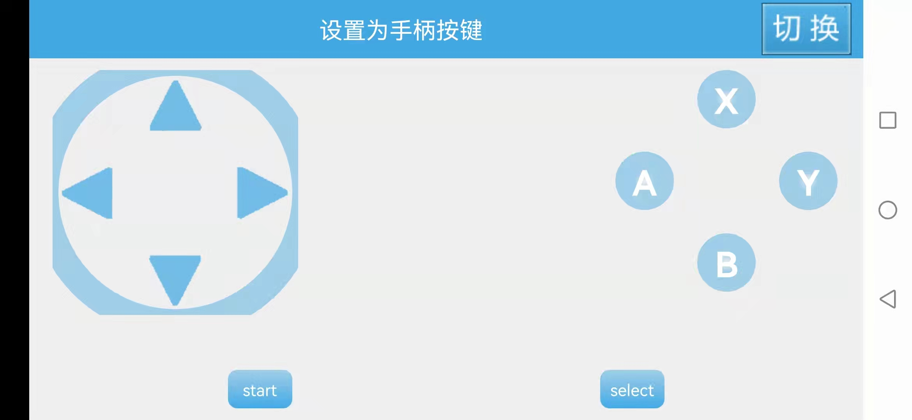

图5.2.1-10
#### **5.2.2 蓝牙方式**
首先声明一下，我不推荐使用蓝牙方式。蓝牙方式配置复杂，且稳定性不好，如果不是wifi实在是不能用，还是不要使用这种方式了。

1) 这一次首先运行电脑端软件，在图5.2.1-7界面中选择“蓝牙方式”，显示如图5.3-1所示：

6RHM7L{S{U)5WU2T4VY54")

图5.2.2-1

B)运行手机端软件，在图5.2-2所示界面中选择“蓝牙方式”，然后点击按钮。这时会弹出图5.3-2所示的提示框，选择“是”，弹出的等待界面跟图5.2.1-6中是一样。由于手机蓝牙在5分钟内是可连接的，所以这时你要迅速的点击图5.2.2-1中的“搜索”按钮，点击后列表中就会显示一条记录如果5.2.2-3所示，右击这条记录，选择“连接”。

图5.2.2-2

B~(0H)E\_]021XWJK5(88NS")

图5.2.2-3

**注意：**如果你是初次使用手机蓝牙和电脑对接，就会存在一个初始化配对的过程。这样你在5.2.2-3中选择“连接”后，手机会出现如图5.2.2-4所示提示。输入“0000”，点击“确定”后，会在电脑的任务栏系统托盘区弹出一条提示，如图5.2.2-5所示，点击此提示，会弹出“添加Bluetooth设备向导”对话框，在密钥对话框中输入“0000”，然后一直点击“下一步”，知道完成。由于安卓设置蓝牙设备可被其他蓝牙设备发现的时间只有5分钟，所以如果你对蓝牙的操作不熟练的话，可能5分钟内还没有搞定，就这样你就只能重复尝试几次。不过一旦你配对成功一次，下次就不会再重新配对了。

图5.2.2-4

图5.2.2-5

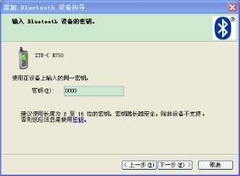

图5.2.2-6

C)在图5.2.2-3右击点击“连接”，如果一切顺利，将会弹出“建立连接成功”的提示，如果5.2.2-7所示。如果通过蓝牙方式，建立连接成功，在手机端同样会跳转5.2-10的界面。

图5.2.2-7
### **5.3 按键操作**
通过5.2.1或者5.2.2建立连接成功后，手机端软件就会显示图5.2.1-10所示的界面。如果你在选择按键方式的时候选择了“手柄”方式请参考5.3.1，“PPT”方式参考5.3.2，“千千静听”方式参考5.3.3。

在连接电脑成功后，点击手机的菜单键，会弹出如下菜单，点击相应的菜单项，即可将手柄设置为相应的类型：

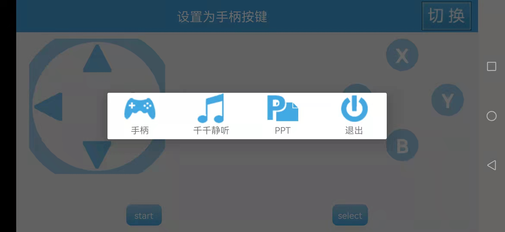

图5.3-1
#### **5.3.1 手柄按键操作**
如果你选择了手柄操作方式，那么各个按钮对应电脑键盘的对照图如图5.3.1-1所示。在电脑上使用游戏模拟器时，只须将模拟器的按键设置的跟下面图片中按键设置成一致的，就可以实现用手机充当游戏机手柄的功能。

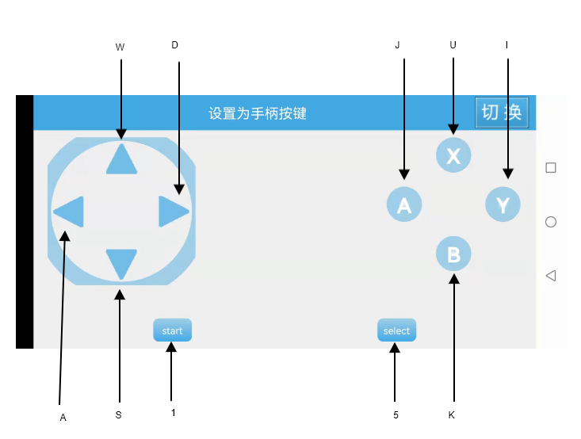

图5.3.1-1
#### **5.3.2 PPT按键操作**
如果你选择了ppt方式，那么各个按键的功能如图5.3.2-1所示。首先点击X键让ppt全屏播放，然后点击向上、向左键都是显示下一页，点击向右、向下键都是显示上一页，点击Y键退出全屏播放。

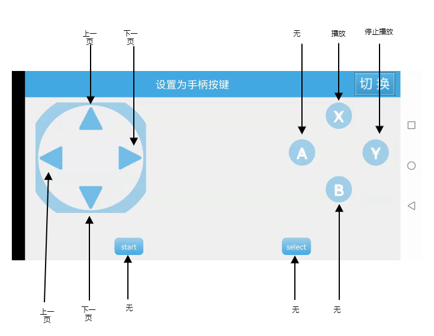

图5.3.2-1
#### **5.3.3 千千静听按键操作**
如果选择了千千静听的按键方式，需要首先确保千千静听开启了全局快捷键。检查的方法如下，首先在任务栏的系统托盘区找到千千静听的图标，右击选择“千千选项...”（图5.3.3-1所示）。在打开的界面中选择“快捷键”，然后确保“启用全局快捷键”出于勾选状态，如果没有勾选需要勾选后，注意保持图5.3.3-2中的默认键设置不要做修改，最后点击“全部保存”然后关闭。以上操作只要设置完一次后，下次就可以直接使用，无需设置。

如果您已经开启了全局快捷键，那么手机端的按键对应的功能如图5.3.3-3所示。

图5.3.3-1

图5.3.3-2

图5.3.3-1
## **5.4 自定义按键管理**
在设置界面中选择自定义按键管理。

图 5.4.1 自定义按键管理进入

进入后显示的界面如下：

图 5.4.2 按键列表

点击添加按钮后，即可添加你想要的按键：

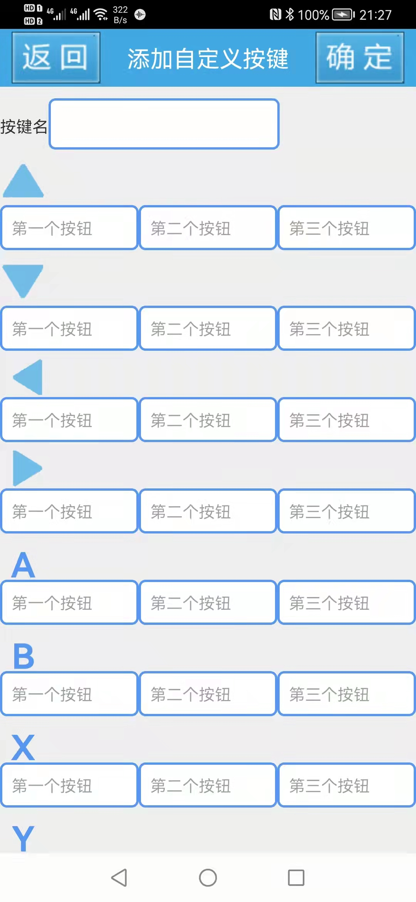

图 5.4.3 添加自定义按键

点击确定后有弹框确认。

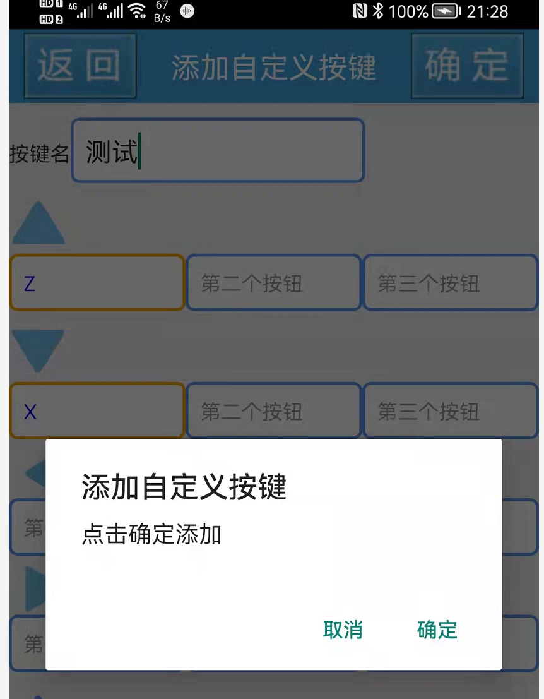

图 5.4.4 积分扣除

添加完成后会在列表中显示新增的按键。

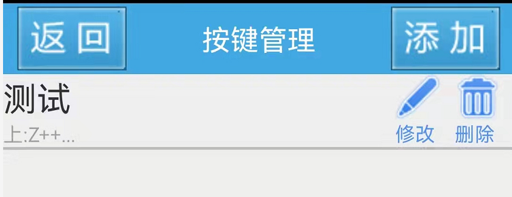

图 5.4.5 添加后的按键

重新连接电脑，在打开的按键界面中选择刚才建立的快捷键组。然后点击相应按键即可。

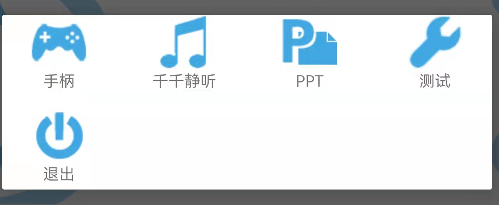

图 5.4.6 使用刚才新建的按键
## **5.5 使用重力感应**
在设置界面首先选择启用重力感应，然后可以在重力感应灵敏度中调节灵敏度。如下图所示：

图 5.5.1 重力感应设置。

在通过5.2所示教程，连接完成后，打开的手机端手柄界面中会出现一个小球，左右转动你的手机，会发现小球会左右滚动，在滚动的过程中，如果往左滚，怎会触发手柄的左向键；往右滚，触发右向键。

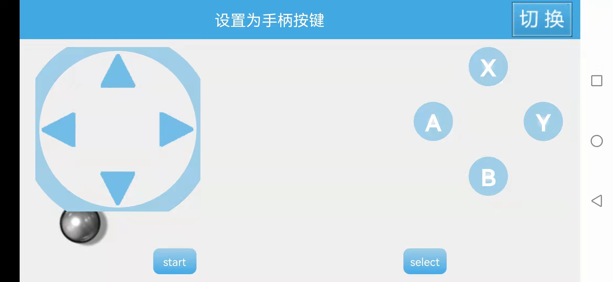

图 5.5.2 启用重力感应后会有小球出现
## **6 联系我们**
如果有什么使用上的疑问，欢迎给我发邮件yunnysunny@gmail.com。
